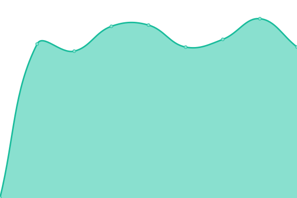
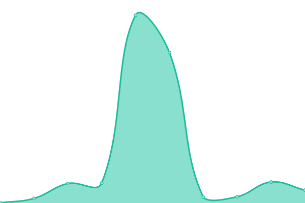
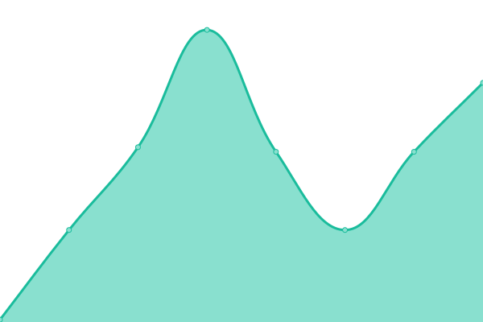
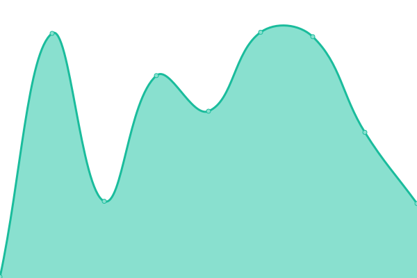
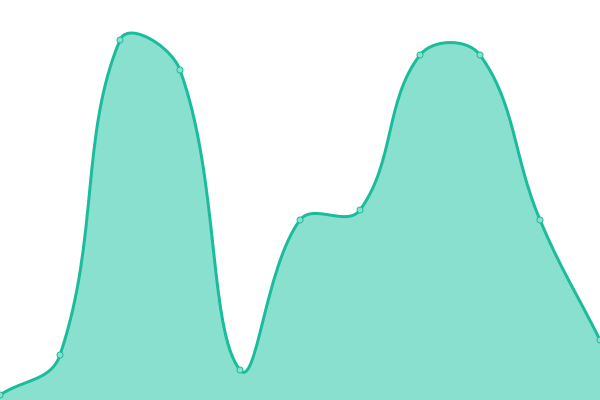

# [📈 Live Status](https://roado.github.io/uptime): <!--live status--> **🟩 All systems operational**

This repository contains the open-source uptime monitor and status page for [RoaDo](https://roado.github.io/uptime), powered by [Upptime](https://github.com/upptime/upptime).

With [Upptime](https://upptime.js.org), you can get your own unlimited and free uptime monitor and status page, powered entirely by a GitHub repository. We use [Issues](https://github.com/roado/uptime/issues) as incident reports, [Actions](https://github.com/roado/uptime/actions) as uptime monitors, and [Pages](https://roado.github.io/uptime) for the status page.

<!--start: status pages-->
<!-- This summary is generated by Upptime (https://github.com/upptime/upptime) -->
<!-- Do not edit this manually, your changes will be overwritten -->
<!-- prettier-ignore -->
| URL | Status | History | Response Time | Uptime |
| --- | ------ | ------- | ------------- | ------ |
|  [Landing Page](https://www.roado.co.in) | 🟩 Up | [landing-page.yml](https://github.com/roado/uptime/commits/HEAD/history/landing-page.yml) | 

 1445ms
     
 | 

<a href="https://roado.github.io/uptime/history/landing-page">99.56%</a>
    

|  [Fleet](https://fleet.roado.tech/) | 🟩 Up | [fleet.yml](https://github.com/roado/uptime/commits/HEAD/history/fleet.yml) | 

 83ms
     
 | 

<a href="https://roado.github.io/uptime/history/fleet">100.00%</a>
    

|  [Industry](https://industry.roado.tech/) | 🟩 Up | [industry.yml](https://github.com/roado/uptime/commits/HEAD/history/industry.yml) | 

 81ms
     
 | 

<a href="https://roado.github.io/uptime/history/industry">100.00%</a>
    

|  [Beta](https://beta.roado.co.in/) | 🟩 Up | [beta.yml](https://github.com/roado/uptime/commits/HEAD/history/beta.yml) | 

 94ms
     
 | 

<a href="https://roado.github.io/uptime/history/beta">100.00%</a>
    

|  [Roadoapi](https://api.roado.co.in/serverCheck) | 🟩 Up | [roadoapi.yml](https://github.com/roado/uptime/commits/HEAD/history/roadoapi.yml) | 

 129ms
     
 | 

<a href="https://roado.github.io/uptime/history/roadoapi">99.56%</a>
    

|  [mdash](https://api.roado.co.in/fleet/api/health-check) | 🟩 Up | [mdash.yml](https://github.com/roado/uptime/commits/HEAD/history/mdash.yml) | 

 29ms
     
 | 

<a href="https://roado.github.io/uptime/history/mdash">99.48%</a>
    

<!--end: status pages-->

[**Visit our status website →**](https://roado.github.io/uptime)

## 📄 License

- Powered by: [Upptime](https://github.com/upptime/upptime)
- Code: [MIT](./LICENSE) © [RoaDo](https://roado.github.io/uptime)
- Data in the `./history` directory: [Open Database License](https://opendatacommons.org/licenses/odbl/1-0/)
